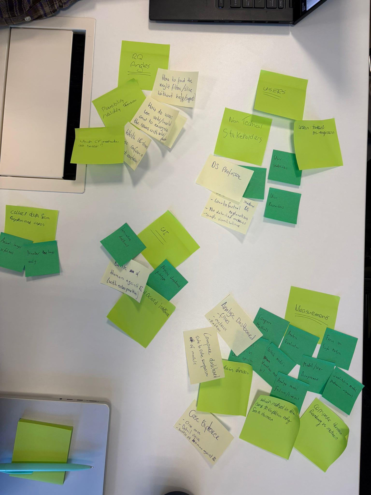
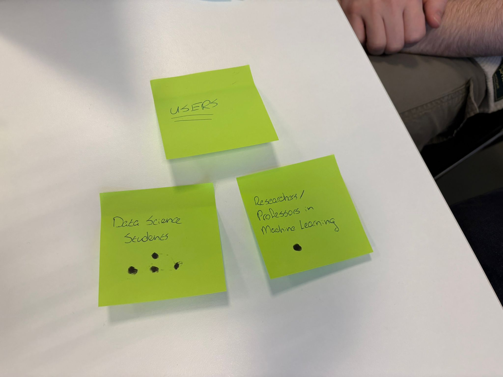
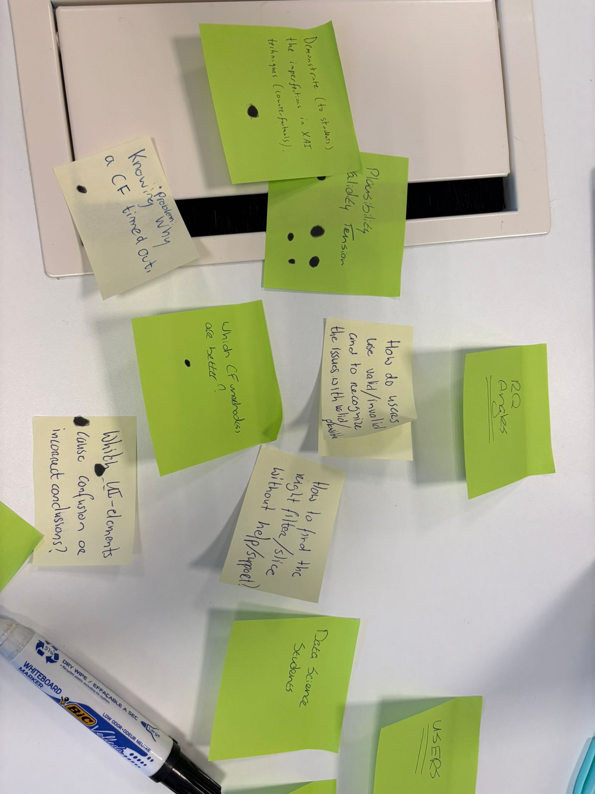
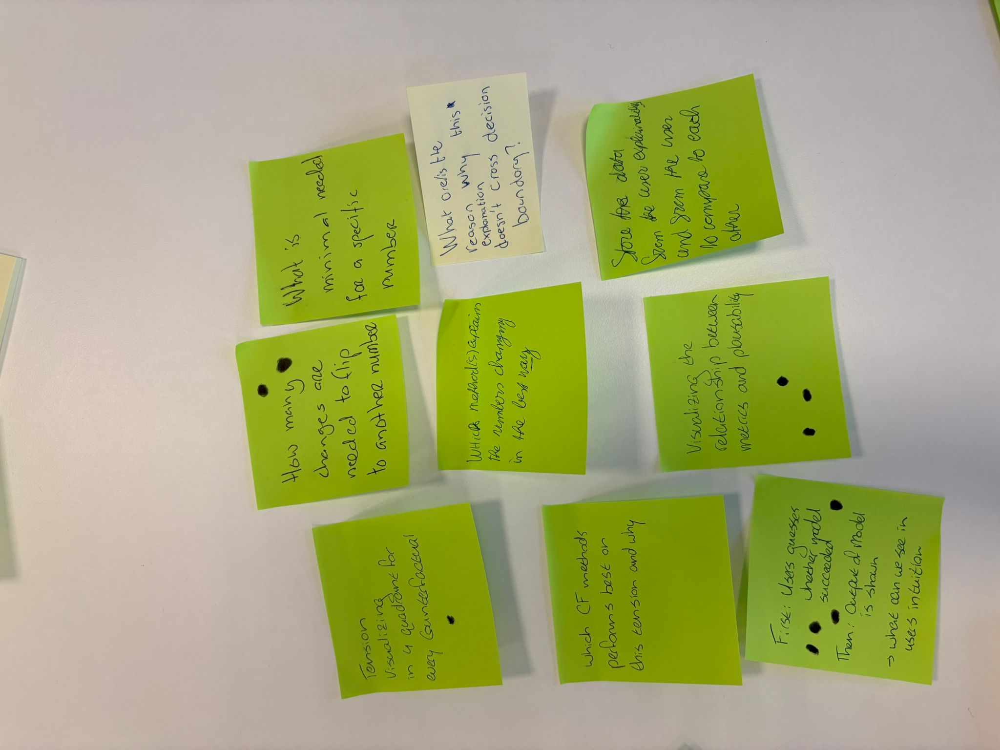
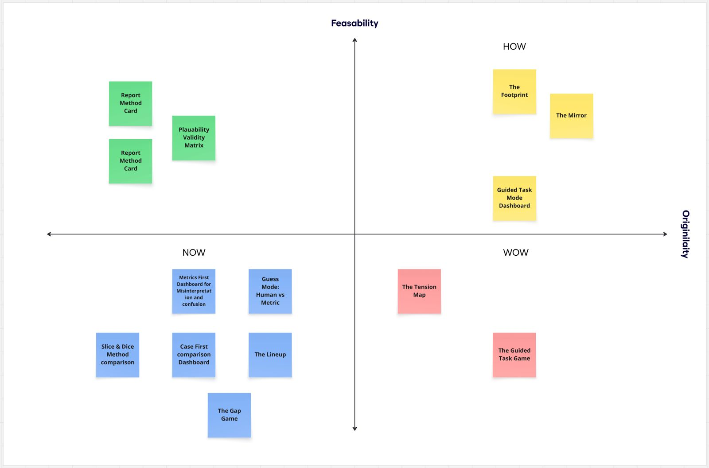

# 1 Introduction

## 1.1 Assignment Description

This project is conducted within the course *Interactive and Explainable AI Design* and focuses on Assignment B, which involves designing and evaluating an interactive dashboard for exploring counterfactual explanations. The assignment is situated in the domain of explainable artificial intelligence (XAI), where the goal is not only to provide explanations for model predictions, but also to understand how users interpret and interact with these explanations in practice [@guidotti2018survey].

Counterfactual explanations are a widely used post-hoc explanation technique, first formalized by [@wachter2017counterfactual]. A counterfactual describes the minimal change to an input instance required to obtain a different model prediction, effectively answering the question of what needs to change for a different outcome to occur. In the context of image classification, this corresponds to modifying an image such that the model predicts a specified target class instead of the original prediction.

A key challenge in this domain is the evaluation of counterfactual explanations. Multiple evaluation criteria exist, of which validity and plausibility are among the most prominent. Validity refers to whether the counterfactual successfully changes the model’s prediction to the desired target class, while plausibility captures whether the resulting explanation appears realistic or meaningful to a human observer.

Importantly, these evaluation dimensions do not always align. A counterfactual may be valid according to the model, yet appear implausible to a human, or vice versa. This reflects a broader issue in explainable AI, where objective evaluation metrics and human perception can diverge [@doshivelez2017rigorous]. Prior research suggests that different explanation methods and evaluation criteria may lead to conflicting interpretations, creating ambiguity for users attempting to assess explanation quality [@guidotti2018survey].

The objective of this assignment is therefore twofold. First, to design a dashboard that enables users to explore and compare counterfactual explanations in a structured and intuitive way. Second, to evaluate how users interpret these explanations and whether their judgments align with objective evaluation metrics.

## 1.2 Design Debrief

The goal of this project is to design an interactive dashboard that reveals and helps analyse the gap between human intuition and model-based evaluation of counterfactual explanations. The primary target users are data science students, with machine learning researchers as a secondary audience. These users are assumed to have a basic understanding of model evaluation, but may still experience difficulty in interpreting counterfactual explanations consistently.

The core problem addressed in this design is that users tend to rely on visual intuition when evaluating explanations, while objective metrics such as validity and plausibility provide a different, and sometimes conflicting, perspective. Furthermore, prior work indicates that the way explanation information is presented can influence user judgment, for example by anchoring decisions on numerical metrics rather than independent reasoning [@kaur2020interpreting].

To address this issue, the project introduces a *Guided Task Mode* dashboard. Instead of supporting unrestricted exploration, the interface guides users through a structured sequence of evaluation steps. Users first assess counterfactual explanations based solely on visual inspection, then estimate evaluation metrics, and only afterwards are the actual metrics revealed. This controlled progression is intended to support independent judgment before exposing users to model-based evaluation, enabling a clearer comparison between intuition and objective metrics.

The dashboard functions both as an analysis tool and as a data collection instrument. It captures user judgments, metric estimates, method selections, and qualitative reflections within a single interaction flow. This makes it possible to analyse how users interpret counterfactual explanations, how confident they are in their judgments, and where discrepancies between human perception and model-based evaluation may occur.

This design follows a user-centered perspective on explainable AI, in which explanations are not only evaluated based on technical correctness, but also on how effectively they support human understanding and decision-making [@amershi2019guidelines].

Based on this motivation, the central research question guiding this project is:

::: {.callout-note appearance="simple"}
## Research Question

*To what extent do human judgments of counterfactual explanation quality align with objective evaluation metrics, and how can interface design reveal or reduce discrepancies between the two?*
:::

# 2 Empathize Phase

## 2.1 Methods Used

The goal of the empathize phase was to develop a well-grounded understanding of both the problem space and the intended user group. In line with the design thinking framework, this phase focuses on uncovering user needs, identifying pain points, and understanding how current approaches to counterfactual explanations may limit effective interpretation.

To achieve this, three complementary methods were applied: (1) a structured affinity mapping workshop, (2) a literature scan of explainable AI (XAI) challenges and tools, and (3) a technical inspection of the provided counterfactual dataset. These methods were combined to ensure both user-centered and technology-oriented insights.

### Affinity Mapping Workshop

A collaborative workshop was conducted in which all team members independently generated observations, questions, and assumptions related to counterfactual explanations. These were written on post-it notes and subsequently grouped using affinity mapping. This approach allowed the team to externalize assumptions and identify patterns across perspectives.

{width="450"}

The workshop focused on three key areas:

1.  understanding how users interpret counterfactual explanations
2.  identifying sources of confusion or misinterpretation
3.  exploring potential use cases and interaction patterns

The clustering process suggested several recurring themes. Many notes pointed to the difficulty of determining which counterfactual explanation is “better,” especially when multiple methods produce different results. Other clusters indicated uncertainty about how to interpret evaluation metrics and when these metrics can be trusted.

Importantly, this method surfaced both preliminary insights and open questions, such as how users form judgments without guidance and whether they rely more on visual intuition or numerical metrics.

### User Identification and Target Group Definition

During the workshop, potential user groups were identified and refined. The primary user group was defined as data science students, while machine learning researchers were considered a secondary group.

{width="436"}

Data science students are expected to have a basic understanding of machine learning concepts but limited experience with evaluating explanation quality. They may therefore rely more strongly on visual intuition and may not fully understand the implications of different evaluation metrics.

Machine learning researchers, in contrast, are more familiar with model evaluation but may still face challenges when comparing multiple explanation methods or interpreting trade-offs between different metrics.

### Literature Scan

A targeted literature scan was conducted to contextualize the observed challenges within existing research on explainable AI. Prior work indicates that explanation quality is inherently multi-dimensional and that no single metric fully captures what makes an explanation “good” [@guidotti2018survey].

Furthermore, research suggests that there can be a gap between objective evaluation metrics and human interpretability. Doshi-Velez and Kim argue that interpretability should be evaluated with respect to human understanding, rather than purely technical criteria [@doshivelez2017rigorous].

In addition, studies on human interaction with explanation tools indicate that users can be influenced by how information is presented. For example, numerical metrics may lead to anchoring effects, where users base their judgment on the metric rather than forming an independent assessment [@kaur2020interpreting].

These findings provided a theoretical basis for interpreting the workshop results.

### Technical Inspection of the Dataset

A technical inspection of the dataset was conducted by manually exploring a subset of cases in which multiple counterfactual explanations were generated for the same input instance. For each case, the outputs of different methods were compared alongside their associated evaluation metrics.

This inspection suggested that different methods can produce substantially different counterfactuals for the same input. In several observed cases, explanations that appeared visually plausible did not achieve the intended target prediction, while other explanations that were classified as valid by the model appeared less intuitive from a human perspective.

These observations indicate that trade-offs between different evaluation dimensions are present, and that explanation quality cannot be fully captured by a single criterion.

## 2.2 Results and Insights

The combination of methods resulted in a set of key insights that informed the subsequent design phases.

### Insight 1: Users struggle to distinguish validity from plausibility

A central observation from the affinity mapping session is that users have difficulty distinguishing between explanations that are technically correct and those that appear visually convincing.

{#fig-brainwriting1 width="438"}

Users tend to interpret explanations based on visual similarity or perceived realism, rather than on whether the explanation actually changes the model prediction. As a result, explanations that are valid may be rejected, while implausible explanations may be accepted.

### Insight 2: Metrics can influence user judgment

Another insight is that the presence of evaluation metrics can influence how users interpret explanations.

{width="437"}

Participants indicated that numerical values shown early in the process may guide decision-making. Instead of forming an independent judgment, users may rely on the metric as a heuristic, which can reduce critical reflection.

### Insight 3: Comparing multiple explanations is cognitively demanding

Users expressed difficulty in comparing multiple counterfactual explanations simultaneously.

{width="449"}

The presence of multiple methods introduces several challenges:

-   uncertainty about which criteria to use for comparison
-   difficulty in tracking differences between explanations
-   increased cognitive load when many options are presented

### Insight 4: The gap between intuition and metrics is not explicit

An important insight is that the discrepancy between human intuition and model-based evaluation is not explicitly represented in existing tools.

Users may form an initial judgment based on visual inspection, but this judgment is typically not compared to objective metrics in a structured way. As a result, potential misalignment remains implicit.

### Insight 5: Users benefit from structured guidance

A final insight is that users may benefit from structured guidance when interpreting explanations, rather than fully open exploration.

Without guidance, users may:

-   focus on less relevant aspects of the explanation
-   misinterpret evaluation metrics
-   draw inconsistent conclusions

## 2.3 Transition to Define Phase

The empathize phase highlights a consistent pattern: users experience difficulty interpreting counterfactual explanations, particularly due to the misalignment between visual intuition and objective evaluation metrics. This challenge is reinforced by the way information is presented and by the complexity of comparing multiple explanations.

Based on these findings, the design focus is narrowed to the following challenge:

::: {.callout-note appearance="simple"}
How to design an interface that reveals and supports the interpretation of the gap between human intuition and model-based evaluation.
:::

This forms the basis for the define phase, where the problem will be formalized into a clear problem statement.

# 3 Define Phase

## 3.1 Problem Statement

The empathize phase revealed a consistent challenge: users experience difficulty in interpreting counterfactual explanations due to the misalignment between visual intuition and objective evaluation metrics. While users tend to rely on visual similarity and perceived plausibility, model-based metrics such as validity may indicate a different assessment of explanation quality.

This leads to the following problem statement:

::: {.callout-note appearance="simple"}
*A data science student needs a way to systematically interpret and compare counterfactual explanations, because current representations do not make the relationship between human intuition and evaluation metrics explicit, resulting in confusion and inconsistent judgments.*
:::

This problem is directly grounded in the insights from the empathize phase, where users expressed uncertainty about how to interpret metrics, difficulty in comparing multiple explanations, and a tendency to rely on intuition without validation.

## 3.2 Target User

The primary target user for this project is a data science student. These users typically have a foundational understanding of machine learning models and evaluation concepts, but limited experience with interpreting explanation quality, especially in situations where multiple evaluation criteria are involved.

Data science students are likely to:

-   rely on visual intuition when evaluating explanations
-   have difficulty interpreting abstract evaluation metrics
-   struggle to compare multiple counterfactual methods

A secondary user group consists of machine learning researchers. While these users are more experienced with model evaluation, they may still face challenges when comparing explanation methods or analysing trade-offs between different evaluation criteria.

The design primarily focuses on supporting data science students, while remaining relevant for more advanced users.

## 3.3 Focus for Ideation

Based on the insights from the empathize phase, the design focus is narrowed to one central challenge: making the gap between human intuition and model-based evaluation visible and interpretable.

This focus is derived from three key observations:

1.  Users struggle to distinguish between validity and plausibility
2.  Evaluation metrics can influence or bias user judgment
3.  Comparing multiple explanations introduces cognitive complexity

These observations indicate that the core issue is not only the availability of explanations, but how they are interpreted and compared.

Rather than designing a dashboard that prioritizes exploration or metric visualization, the design will focus on structuring the interaction in such a way that users first form an independent judgment, and only then are confronted with model-based evaluation.

This leads to the following design direction:

-   guide users through a step-by-step evaluation process
-   separate intuition from metric-based evaluation
-   explicitly compare user judgments with model outputs

This direction forms the basis for the ideation phase, where multiple design concepts will be explored to determine how such a guided interaction can be implemented effectively.

# 4 Ideation Phase

## 4.1 Divergence — Generating Design Concepts

Following the define phase, the ideation phase focused on exploring a broad range of possible solutions to address the central challenge: *making the gap between human intuition and model-based evaluation visible and interpretable*.

To ensure sufficient divergence, a structured brainwriting session was conducted. Each team member independently generated ideas before sharing them with the group. This approach reduced the risk of early convergence on familiar solutions and encouraged the exploration of alternative interaction patterns.

{#fig-brainwriting2 width="453"}

Figure @fig-brainwriting2 illustrates the divergence phase. The variety of post-it notes reflects multiple directions, including dashboard-based exploration, metric-driven evaluation, comparison views, and more structured interaction flows.

Ideas were intentionally not evaluated during the initial generation phase. This allowed both conventional and more experimental concepts to emerge before introducing selection criteria.

The generated ideas can be grouped into several concept categories.

### Free Exploration Dashboard

One concept focused on a traditional dashboard approach, where users can freely explore counterfactual explanations using filters, dropdowns, and coordinated visualizations.

Strengths:

-   Supports flexible exploration and user control
-   Aligns with familiar dashboard interaction patterns
-   Allows users to define their own analysis process

Limitations:

-   Requires users to determine their own evaluation strategy
-   Does not reduce cognitive load when comparing multiple explanations
-   Offers limited support for interpreting evaluation metrics

Relation to the core problem: This concept does not explicitly address the gap between intuition and model-based evaluation. It assumes that users are able to interpret explanations independently, which contradicts the findings from the empathize phase.

### Metric-First Evaluation Interface

Another concept prioritized evaluation metrics as the primary entry point. Users would first see values such as validity and plausibility, and then inspect the corresponding counterfactual explanations.

Strengths:

-   Supports systematic and metric-driven evaluation
-   Makes quantitative differences between methods explicit
-   Efficient for expert users

Limitations:

-   Risks influencing user judgment through anchoring effects
-   Reduces the role of independent interpretation
-   May discourage critical reflection

Relation to the core problem: This concept potentially reinforces the misalignment between intuition and metrics by prioritizing numerical values over user interpretation. It therefore does not support the goal of making this gap visible.

### Explanation Comparison View

A third concept focused on side-by-side comparison of multiple counterfactual explanations.

{#fig-patterns width="407"}

Strengths:

-   Enables direct comparison between different methods
-   Makes visual differences between explanations observable
-   Supports exploratory analysis

Limitations:

-   Introduces cognitive load when multiple explanations are presented
-   Does not provide guidance on how to evaluate differences
-   Leaves interpretation strategy undefined

Relation to the core problem:\
While this concept supports comparison, it does not explicitly structure the relationship between intuition and metrics. Users are still required to interpret both independently.

### Ranking-Based Interface

Another idea involved automatically ranking counterfactual explanations based on selected metrics.

Strengths:

-   Reduces decision effort for users
-   Provides a clear outcome based on defined criteria
-   Supports quick identification of “best” explanations

Limitations:

-   Removes the need for user interpretation
-   Obscures trade-offs between different metrics
-   Does not expose disagreement between human judgment and model evaluation

Relation to the core problem:\
This concept bypasses the central issue by replacing user judgment with automated ranking. As a result, it does not support the investigation of discrepancies between intuition and metrics.

### Guided Task Mode

The final concept introduced a structured interaction flow in which users are guided through a sequence of evaluation steps.

In this concept, users:

1.  evaluate explanations based on visual inspection
2.  estimate evaluation metrics
3.  are presented with actual model metrics
4.  reflect on differences between their judgment and the model output

Strengths:

-   Structures the evaluation process
-   Separates intuition from metric-based evaluation
-   Enables direct comparison between user input and model output
-   Reduces cognitive load through step-by-step interaction

Limitations:

-   Less flexible than free exploration dashboards
-   Requires careful design to avoid over-guidance

Relation to the core problem:\
This concept directly addresses the central challenge by making the relationship between intuition and metrics explicit. It operationalizes the gap identified in the empathize phase and creates a measurable interaction.

## 4.2 COCD Box — Structuring Divergence and Convergence

To support convergence, the generated ideas were mapped onto a COCD (Creative Problem Solving) box, positioning them based on feasibility and originality.

The COCD box distinguishes four quadrants:

-   Now: high feasibility, low originality
-   How: high feasibility, higher originality
-   Wow: high originality, lower feasibility
-   Non-ideas: low feasibility and low relevance

Most ideas were positioned in the “Now” quadrant, including *Metrics First Dashboard*, *Case First Comparison Dashboard*, *Slice & Dice Method Comparison*, *The Lineup*, and *The Gap Game*. These concepts are feasible and align with established design patterns, but do not fundamentally change how users interpret explanations.

Several concepts were positioned in the “How” quadrant, including *The Footprint*, *The Mirror*, and the *Guided Task Mode Dashboard*. These ideas introduce new interaction patterns while remaining feasible within the scope of the project.

Two concepts, *The Tension Map* and *The Guided Task Game*, were placed in the “Wow” quadrant. While these ideas offer high originality, they were considered less feasible to implement within the available time constraints.

The distribution of ideas indicates that initial ideation tended to gravitate toward familiar solutions. The COCD mapping made it possible to explicitly identify and select concepts that introduce meaningful innovation while remaining implementable.

## 4.3 Convergence — Selection of Design Direction

Based on the COCD analysis and the insights from the empathize and define phases, the *Guided Task Mode Dashboard* was selected as the primary design direction.

This decision is based on three considerations.

### Alignment with User Needs

The guided task mode addresses the observed difficulties in interpreting counterfactual explanations by structuring the evaluation process. It reduces cognitive complexity and supports users in forming judgments step by step.

Unlike free exploration approaches, it provides guidance without removing user agency.

### Mitigating Metric Bias

The empathize phase highlighted the risk of metric-driven bias. The guided task mode addresses this by delaying the presentation of evaluation metrics.

Users first form an independent judgment, after which they are exposed to model-based evaluation. This supports a clearer distinction between intuition and metrics.

### Making the Core Problem Observable

The guided task mode makes the central problem measurable. By capturing both user judgments and model outputs, it enables the analysis of discrepancies between the two.

Alternative concepts either prioritize exploration or automate evaluation, but do not make this relationship explicit.

## 4.4 Design Direction

The selected design direction can be summarized as follows:

-   a step-by-step interaction flow that guides users through evaluation tasks
-   separation between intuitive judgment and metric-based evaluation
-   explicit comparison between user input and model output
-   structured reflection on discrepancies

This direction ensures that the design is directly aligned with the research question and provides a clear foundation for the prototype phase, where the guided interaction is translated into a concrete interface.

# Prototype Phase

## Prototype Description

The prototype is an interactive web-based dashboard built with Streamlit, designed to serve two types of users: **study participants** (data science students who evaluate counterfactual explanations) and **researchers** (who collect and analyse the resulting data). The dashboard runs on real data, PyTorch image tensors generated by five CF methods across two datasets (MNIST and CIFAR-10) and supports genuine interaction at every step, making it appropriate for a real user study rather than a demonstration.

The application is structured around two pages accessible via a persistent sidebar:

**Guided Task Mode** is the core of the prototype. It presents participants with a structured, seven-step linear evaluation flow for one randomly sampled case. Each case consists of an original image and its counterfactual explanations produced by five methods: PIECE, Min-Edit, C-Min-Edit, Alibi-Proto-CF, and Alibi-CF. The flow is deliberately locked, participants cannot skip ahead or revisit earlier steps, ensuring that information is revealed in a controlled sequence. Each step collects a different type of input: binary judgments, free-text explanations, slider estimates, ranked selections, and dropdown choices. All inputs across all seven steps are saved as a single session entry to a JSON log file upon completion of step 7.

**Game Results** is the analysis page. It is always accessible from the sidebar, even while a session is in progress, allowing researchers to monitor collected data in real time. It displays aggregate outcomes across all completed sessions: which CF method was most frequently selected as best under three different criteria (overall, most plausible, most valid), average confidence per method pick, distributions of participant validity and plausibility estimates, and qualitative responses collected from the free-text fields. Raw session data can be exported as CSV directly from this page.

## Design Decisions

### Linear, locked step progression

The seven steps follow a strict linear order and participants cannot navigate freely between them. This decision was driven directly by the core research question: to measure how human judgment of CF quality diverges from objective evaluation metrics. If participants could jump immediately to a step showing metrics, they would anchor their judgments on those numbers rather than forming an independent opinion. The linear lock ensures that intuition is always captured *before* information is revealed, making the collected data meaningful for comparison. Each step builds on the previous one in a deliberate sequence: first pure visual judgment, then estimation, then selection, then revelation, then reflection.

### Showing one random CF method in steps 1 and 2 before the full lineup

In steps 1 and 2, participants see only the original image and one randomly chosen CF method, with no indication of which method it is. All five methods are only revealed together in step 3. This design choice serves two purposes. First, it forces the participant to form a genuine impression of a single explanation , evaluating it on its own terms for plausibility and validity,before they can compare across methods. Second, by hiding the method name, it removes a potential source of bias: a participant who already knows that "PIECE" or "Alibi-CF" tends to perform well might unconsciously favour it regardless of what the image looks like.

### Combining free-text and structured input

At several steps the prototype collects both a structured response (slider, radio button, dropdown) and an optional free-text field. These two formats serve complementary purposes. The structured inputs produce quantitative data that can be aggregated across participants, for example, comparing the distribution of plausibility estimates in step 2 against actual IM1 scores. The free-text fields capture the *reasoning* behind those choices, which structured inputs cannot. When a participant writes that they chose a particular method because "the digit still looked like the original but subtly different," that explains *why* human judgment diverges from a metric, not just *that* it does. Together the two formats allow both statistical analysis and qualitative interpretation.

### Hiding metrics until step 4

Evaluation metrics (validity, IM1, implausibility) are not shown to participants until step 4, after they have already completed their visual judgment, their estimates, and their game pick. This is the most consequential design decision in the prototype and it maps directly to the research question. If participants saw, for example, that a CF has a correctness score of 1 (valid) before judging it visually, their judgment would reflect the metric rather than their own perception. The study is specifically designed to detect cases where the metric and the human differ and that detection is only possible if the human judgment is formed independently first.

### The Game as the primary data collection mechanism

Step 3: the Game, is where the most analytically valuable data point is collected: which method does the participant believe produced the best CF explanation, based on visual inspection alone, without any metric information? This maps directly onto the research question because the Game Results page can then show, across all participants, which method humans most consistently preferred, and compare that against which method was objectively best according to validity and plausibility metrics. When those two rankings diverge, it is direct evidence of a gap between human intuition and objective evaluation.

### Collecting all inputs per session, not per step

Rather than logging partial responses after each step, the prototype saves one complete entry per session only when step 7 is finished. This ensures the dataset is clean, every saved entry represents a participant who went through the full protocol, and that all inputs from all steps are stored together, making it straightforward to compare a single participant's step 1 judgment against their step 6 dropdown picks and their step 7 reflection within the same row of data.

### Dataset choice

Both MNIST and CIFAR-10 are included because they were specified in the course assignment as the two evaluation benchmarks. Including both means the study covers a simple greyscale digit recognition task and a more complex colour image classification task, which may surface different patterns in how human perception aligns with metrics. Cases are sampled randomly from whichever instances have non-blank CF images available across a sufficient number of methods.

## Prototype Screenshots

> **Note:** Screenshots to be added. For each step, run the dashboard with real data, complete the flow, and capture a screenshot. Label each image as indicated below.

**Figure 5.1 — Welcome screen and participant name entry**

*\[Screenshot: Step 0, name entry screen\]*

**Figure 5.2 — Step 1: Visual Inspection**

*\[Screenshot: Original image and one random CF method shown, judgment radio buttons and free-text field visible\]*

**Figure 5.3 — Step 2: Your Prediction**

*\[Screenshot: Same image pair with validity and plausibility sliders\]*

**Figure 5.4 — Step 3: The Game**

*\[Screenshot: Full lineup of all 5 CF methods, method selection radio and confidence slider visible\]*

**Figure 5.5 — Step 4: Actual Metrics Revealed**

*\[Screenshot: Metric comparison panel showing participant estimates vs. actual values\]*

**Figure 5.6 — Step 5: Explanation and Feedback**

*\[Screenshot: Ranked method list and free-text reasoning field\]*

**Figure 5.7 — Step 6: Compare Methods on This Case**

*\[Screenshot: Full image grid with metrics table and three dropdown selectors\]*

**Figure 5.8 — Step 7: Confidence and Final Thoughts**

*\[Screenshot: Post-reveal confidence slider, change-answer radio, and final thoughts text area\]*

**Figure 5.9 — Game Results page**

*\[Screenshot: Aggregate bar charts of method picks, winner badges, qualitative responses panel\]*

### Archive

**Earlier prototype version**

The dashboard was initially built as a simpler Guess Mode interface in which participants were shown one CF at a time and asked only whether they thought it was valid (yes or no), with their response immediately compared against the actual correctness score. This version collected minimal data and did not capture the reasoning behind judgments or allow comparison across methods within the same case.

*\[Screenshot: Earlier Guess Mode interface\]*

The Guided Task Mode was developed as a replacement to address the limitations of this approach: the binary guess format did not allow measurement of plausibility perception, did not capture why participants made their choices, and did not enable cross-method comparison within a single case, all of which are necessary to answer the research question with depth.

**Dashboard file:** `app.py` (run with `streamlit run app.py`)

**Data log:** `game_log.json` (auto-generated, appended to after each completed session)

# Test Phase (4 pages)

## Research Question

## Method

## Results

## Insights

# Conclusions & Recommendations (4 pages)

## Conclusions from User Testing

## Improvement Recommendations

## Final Design Concept

## User Interaction in Context

# Design Archive Description (0.5 page)

## Archive Overview

# Appendix

# References
