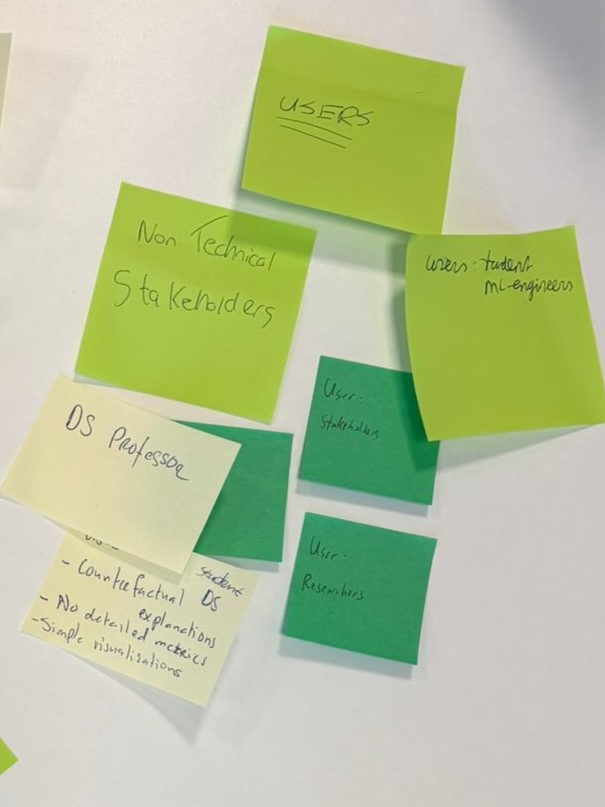
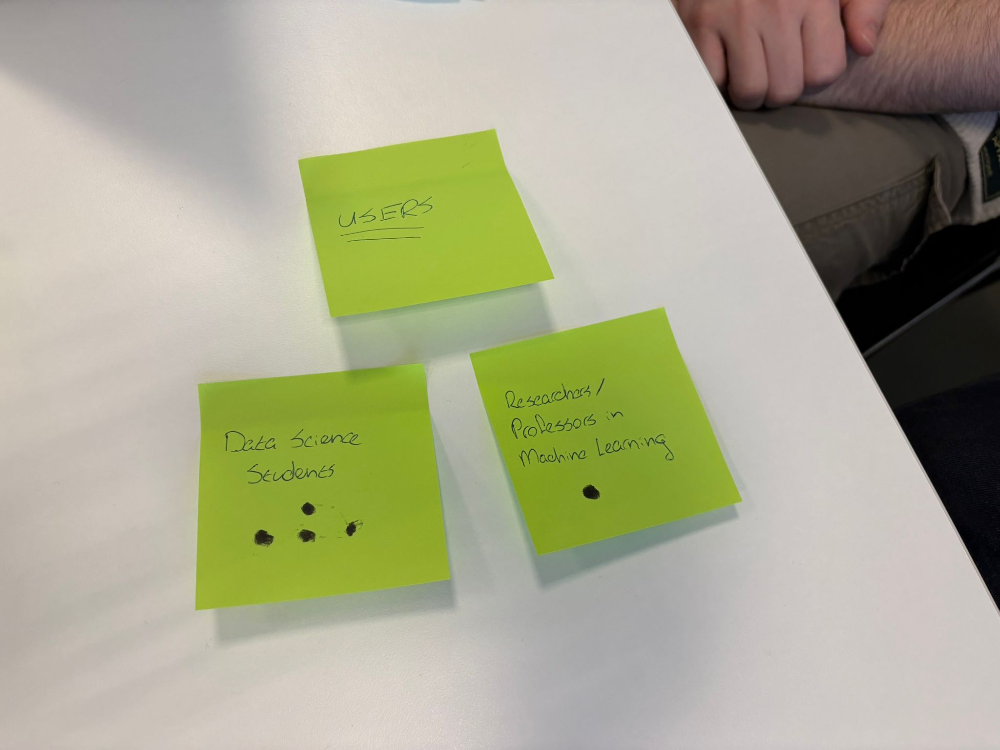
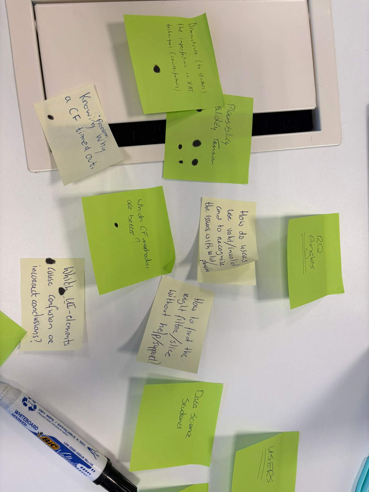
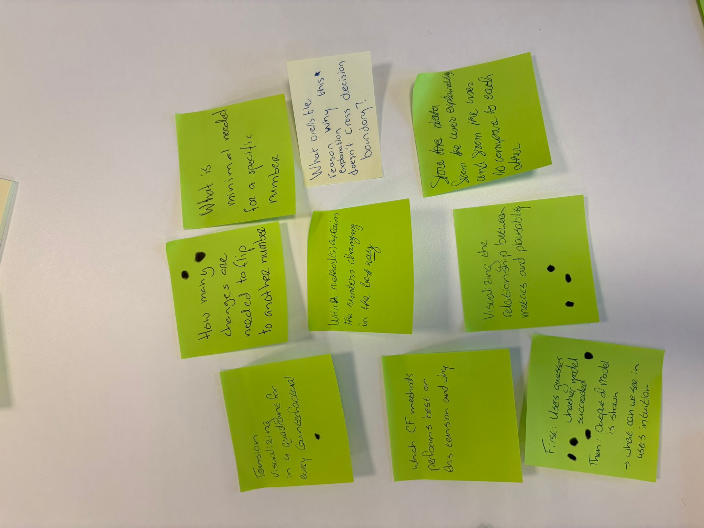
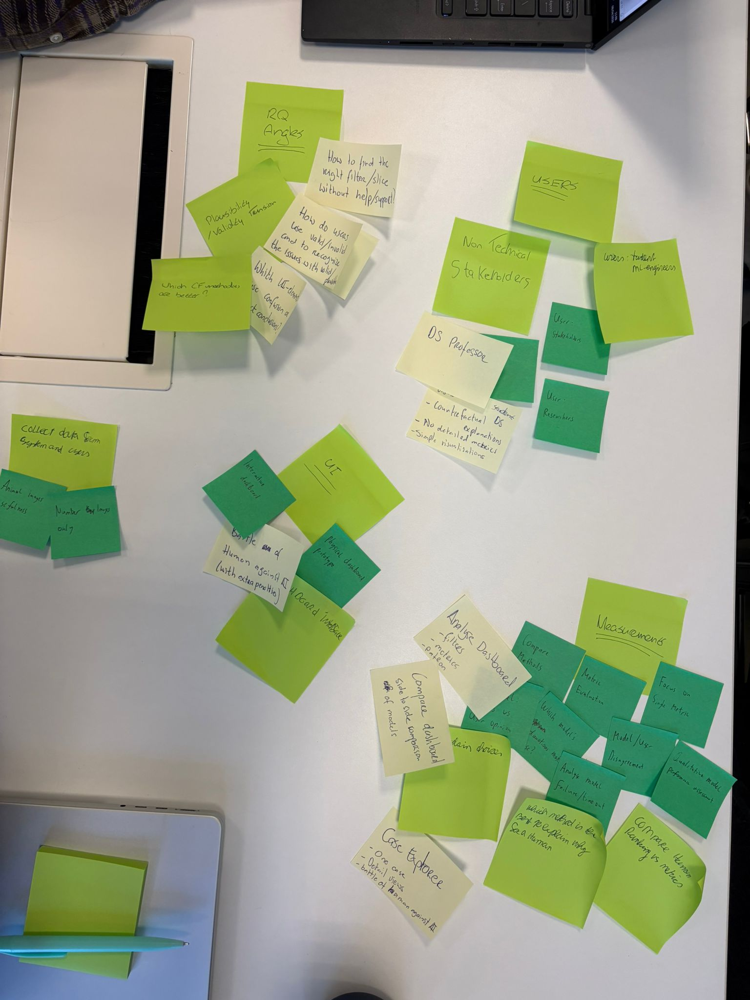
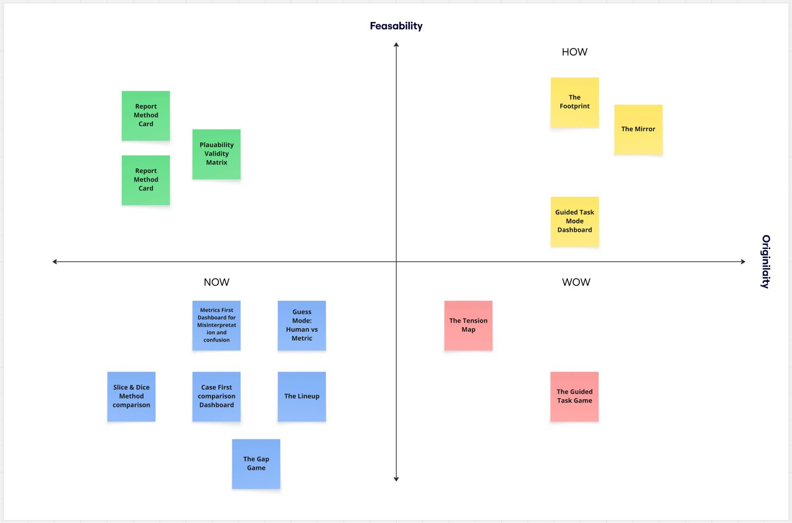
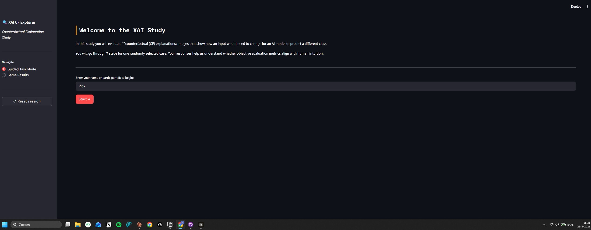
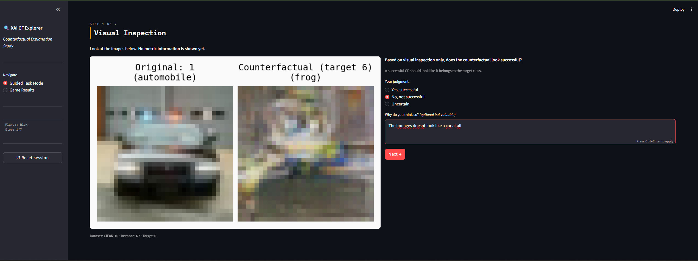
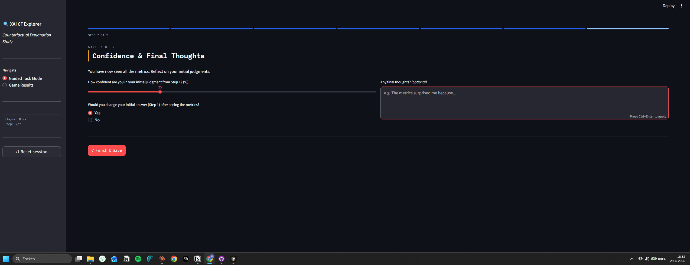

# 1 Introduction

## 1.1 Assignment Description

This project is conducted within the course *Interactive and Explainable AI Design* and focuses on Assignment B, which involves designing and evaluating an interactive dashboard for exploring counterfactual explanations. The assignment is situated in the domain of explainable artificial intelligence (XAI), where the goal is not only to provide explanations for model predictions, but also to understand how users interpret and interact with these explanations in practice [@guidotti2018survey].

Counterfactual explanations are a widely used post-hoc explanation technique, first formalized by [@wachter2017counterfactual]. A counterfactual describes the minimal change to an input instance required to obtain a different model prediction, effectively answering the question of what needs to change for a different outcome to occur. In the context of image classification, this corresponds to modifying an image such that the model predicts a specified target class instead of the original prediction.

A key challenge in this domain is the evaluation of counterfactual explanations. Multiple evaluation criteria exist, of which validity and plausibility are among the most prominent. Validity refers to whether the counterfactual successfully changes the model’s prediction to the desired target class, while plausibility captures whether the resulting explanation appears realistic or meaningful to a human observer.

Importantly, these evaluation dimensions do not always align. A counterfactual may be valid according to the model, yet appear implausible to a human, or vice versa. This reflects a broader issue in explainable AI, where objective evaluation metrics and human perception can diverge [@doshivelez2017rigorous]. Prior research suggests that different explanation methods and evaluation criteria may lead to conflicting interpretations, creating ambiguity for users attempting to assess explanation quality [@guidotti2018survey].

The objective of this assignment is therefore twofold. First, to design a dashboard that enables users to explore and compare counterfactual explanations in a structured and intuitive way. Second, to evaluate how users interpret these explanations and whether their judgments align with objective evaluation metrics.

## 1.2 Design Debrief

The goal of this project is to design an interactive dashboard that reveals and helps analyse the gap between human intuition and model-based evaluation of counterfactual explanations. The primary target users are data science students, with machine learning researchers as a secondary audience. These users are assumed to have a basic understanding of model evaluation, but may still experience difficulty in interpreting counterfactual explanations consistently.

The core problem addressed in this design is that users tend to rely on visual intuition when evaluating explanations, while objective metrics such as validity and plausibility provide a different, and sometimes conflicting, perspective. Furthermore, prior work indicates that the way explanation information is presented can influence user judgment, for example by anchoring decisions on numerical metrics rather than independent reasoning [@kaur2020interpreting].

To address this issue, the project introduces a *Guided Task Mode* dashboard. Instead of supporting unrestricted exploration, the interface guides users through a structured sequence of evaluation steps. Users first assess counterfactual explanations based solely on visual inspection, then estimate evaluation metrics, and only afterwards are the actual metrics revealed. This controlled progression is intended to support independent judgment before exposing users to model-based evaluation, enabling a clearer comparison between intuition and objective metrics.

The dashboard functions both as an analysis tool and as a data collection instrument. It captures user judgments, metric estimates, method selections, and qualitative reflections within a single interaction flow. This makes it possible to analyse how users interpret counterfactual explanations, how confident they are in their judgments, and where discrepancies between human perception and model-based evaluation may occur.

This design follows a user-centered perspective on explainable AI, in which explanations are not only evaluated based on technical correctness, but also on how effectively they support human understanding and decision-making [@amershi2019guidelines].

Based on this motivation, the central research question guiding this project is:

::: {.callout-note appearance="simple"}
## Research Question

*To what extent do human judgments of counterfactual explanation quality align with objective evaluation metrics, and how can interface design reveal or reduce discrepancies between the two?*
:::

# 2 Empathize Phase

## 2.1 Methods Used

The goal of the empathize phase was to develop a well-grounded understanding of both the problem space and the intended user group. In line with the design thinking framework, this phase focuses on uncovering user needs, identifying pain points, and understanding how current approaches to counterfactual explanations may limit effective interpretation.

To achieve this, three complementary methods were applied: (1) a structured affinity mapping workshop, (2) a literature scan of explainable AI (XAI) challenges and tools, and (3) a technical inspection of the provided counterfactual dataset. These methods were combined to ensure both user-centered and technology-oriented insights.

### Affinity Mapping Workshop

A collaborative workshop was conducted in which all team members independently generated observations, questions, and assumptions related to counterfactual explanations. These were written on post-it notes and subsequently grouped using affinity mapping. This approach allowed the team to externalize assumptions and identify patterns across perspectives.

{width="450"}

The workshop focused on three key areas:

1.  understanding how users interpret counterfactual explanations
2.  identifying sources of confusion or misinterpretation
3.  exploring potential use cases and interaction patterns

The clustering process suggested several recurring themes. Many notes pointed to the difficulty of determining which counterfactual explanation is “better,” especially when multiple methods produce different results. Other clusters indicated uncertainty about how to interpret evaluation metrics and when these metrics can be trusted.

Importantly, this method surfaced both preliminary insights and open questions, such as how users form judgments without guidance and whether they rely more on visual intuition or numerical metrics.

### User Identification and Target Group Definition

During the workshop, potential user groups were identified and refined. The primary user group was defined as data science students, while machine learning researchers were considered a secondary group.

{width="225"}

Data science students are expected to have a basic understanding of machine learning concepts but limited experience with evaluating explanation quality. They may therefore rely more strongly on visual intuition and may not fully understand the implications of different evaluation metrics.

Machine learning researchers, in contrast, are more familiar with model evaluation but may still face challenges when comparing multiple explanation methods or interpreting trade-offs between different metrics.

### Literature Scan

A targeted literature scan was conducted to contextualize the observed challenges within existing research on explainable AI. Prior work indicates that explanation quality is inherently multi-dimensional and that no single metric fully captures what makes an explanation “good” [@guidotti2018survey].

Furthermore, research suggests that there can be a gap between objective evaluation metrics and human interpretability. Doshi-Velez and Kim argue that interpretability should be evaluated with respect to human understanding, rather than purely technical criteria [@doshivelez2017rigorous].

In addition, studies on human interaction with explanation tools indicate that users can be influenced by how information is presented. For example, numerical metrics may lead to anchoring effects, where users base their judgment on the metric rather than forming an independent assessment [@kaur2020interpreting].

These findings provided a theoretical basis for interpreting the workshop results.

### Technical Inspection of the Dataset

A technical inspection of the dataset was conducted by manually exploring a subset of cases in which multiple counterfactual explanations were generated for the same input instance. For each case, the outputs of different methods were compared alongside their associated evaluation metrics.

This inspection suggested that different methods can produce substantially different counterfactuals for the same input. In several observed cases, explanations that appeared visually plausible did not achieve the intended target prediction, while other explanations that were classified as valid by the model appeared less intuitive from a human perspective.

These observations indicate that trade-offs between different evaluation dimensions are present, and that explanation quality cannot be fully captured by a single criterion.

## 2.2 Results and Insights

The combination of methods resulted in a set of key insights that informed the subsequent design phases.

### Insight 1: Users struggle to distinguish validity from plausibility

A central observation from the affinity mapping session is that users have difficulty distinguishing between explanations that are technically correct and those that appear visually convincing.

{#fig-brainwriting1 width="438"}

Users tend to interpret explanations based on visual similarity or perceived realism, rather than on whether the explanation actually changes the model prediction. As a result, explanations that are valid may be rejected, while implausible explanations may be accepted.

### Insight 2: Metrics can influence user judgment

Another insight is that the presence of evaluation metrics can influence how users interpret explanations.

{width="437"}

Participants indicated that numerical values shown early in the process may guide decision-making. Instead of forming an independent judgment, users may rely on the metric as a heuristic, which can reduce critical reflection.

### Insight 3: Comparing multiple explanations is cognitively demanding

Users expressed difficulty in comparing multiple counterfactual explanations simultaneously.

{width="449"}

The presence of multiple methods introduces several challenges:

-   uncertainty about which criteria to use for comparison
-   difficulty in tracking differences between explanations
-   increased cognitive load when many options are presented

### Insight 4: The gap between intuition and metrics is not explicit

An important insight is that the discrepancy between human intuition and model-based evaluation is not explicitly represented in existing tools.

Users may form an initial judgment based on visual inspection, but this judgment is typically not compared to objective metrics in a structured way. As a result, potential misalignment remains implicit.

### Insight 5: Users benefit from structured guidance

A final insight is that users may benefit from structured guidance when interpreting explanations, rather than fully open exploration.

Without guidance, users may:

-   focus on less relevant aspects of the explanation
-   misinterpret evaluation metrics
-   draw inconsistent conclusions

## 2.3 Transition to Define Phase

The empathize phase highlights a consistent pattern: users experience difficulty interpreting counterfactual explanations, particularly due to the misalignment between visual intuition and objective evaluation metrics. This challenge is reinforced by the way information is presented and by the complexity of comparing multiple explanations.

Based on these findings, the design focus is narrowed to the following challenge:

::: {.callout-note appearance="simple"}
How to design an interface that reveals and supports the interpretation of the gap between human intuition and model-based evaluation.
:::

This forms the basis for the define phase, where the problem will be formalized into a clear problem statement.

# 3 Define Phase

## 3.1 Problem Statement

The empathize phase revealed a consistent challenge: users experience difficulty in interpreting counterfactual explanations due to the misalignment between visual intuition and objective evaluation metrics. While users tend to rely on visual similarity and perceived plausibility, model-based metrics such as validity may indicate a different assessment of explanation quality.

This leads to the following problem statement:

::: {.callout-note appearance="simple"}
*A data science student needs a way to systematically interpret and compare counterfactual explanations, because current representations do not make the relationship between human intuition and evaluation metrics explicit, resulting in confusion and inconsistent judgments.*
:::

This problem is directly grounded in the insights from the empathize phase, where users expressed uncertainty about how to interpret metrics, difficulty in comparing multiple explanations, and a tendency to rely on intuition without validation.

## 3.2 Target User

The primary target user for this project is a data science student. These users typically have a foundational understanding of machine learning models and evaluation concepts, but limited experience with interpreting explanation quality, especially in situations where multiple evaluation criteria are involved.

Data science students are likely to:

-   rely on visual intuition when evaluating explanations
-   have difficulty interpreting abstract evaluation metrics
-   struggle to compare multiple counterfactual methods

A secondary user group consists of machine learning researchers. While these users are more experienced with model evaluation, they may still face challenges when comparing explanation methods or analysing trade-offs between different evaluation criteria.

The design primarily focuses on supporting data science students, while remaining relevant for more advanced users.

## 3.3 Focus for Ideation

Based on the insights from the empathize phase, the design focus is narrowed to one central challenge: making the gap between human intuition and model-based evaluation visible and interpretable.

This focus is derived from three key observations:

1.  Users struggle to distinguish between validity and plausibility
2.  Evaluation metrics can influence or bias user judgment
3.  Comparing multiple explanations introduces cognitive complexity

These observations indicate that the core issue is not only the availability of explanations, but how they are interpreted and compared.

Rather than designing a dashboard that prioritizes exploration or metric visualization, the design will focus on structuring the interaction in such a way that users first form an independent judgment, and only then are confronted with model-based evaluation.

This leads to the following design direction:

-   guide users through a step-by-step evaluation process
-   separate intuition from metric-based evaluation
-   explicitly compare user judgments with model outputs

This direction forms the basis for the ideation phase, where multiple design concepts will be explored to determine how such a guided interaction can be implemented effectively.

# 4 Ideation Phase

## 4.1 Divergence: Generating Design Concepts

Following the define phase, the ideation phase focused on exploring a broad range of possible solutions to address the central challenge: making the gap between human intuition and model-based evaluation visible and interpretable.

To ensure sufficient divergence, a structured brainwriting session was conducted. Each team member independently generated ideas before sharing them with the group. This approach reduced the risk of early convergence on familiar solutions and encouraged the exploration of alternative interaction patterns.

{#fig-brainwriting2 width="453"}

@fig-brainwriting2 illustrates the divergence phase. The variety of post-it notes reflects multiple directions, including dashboard-based exploration, metric-driven evaluation, comparison views, and more structured interaction flows.

Ideas were intentionally not evaluated during the initial generation phase. This allowed both conventional and more experimental concepts to emerge before introducing selection criteria.

The generated ideas can be grouped into several concept categories.

### Free Exploration Dashboard

One concept focused on a traditional dashboard approach, where users can freely explore counterfactual explanations using filters, dropdowns, and coordinated visualizations.

Strengths:

-   Supports flexible exploration and user control
-   Aligns with familiar dashboard interaction patterns
-   Allows users to define their own analysis process

Limitations:

-   Requires users to determine their own evaluation strategy
-   Does not reduce cognitive load when comparing multiple explanations
-   Offers limited support for interpreting evaluation metrics

Relation to the core problem: This concept does not explicitly address the gap between intuition and model-based evaluation. It assumes that users are able to interpret explanations independently, which contradicts the findings from the empathize phase.

### Metric-First Evaluation Interface

Another concept prioritized evaluation metrics as the primary entry point. Users would first see values such as validity and plausibility, and then inspect the corresponding counterfactual explanations.

Strengths:

-   Supports systematic and metric-driven evaluation
-   Makes quantitative differences between methods explicit
-   Efficient for expert users

Limitations:

-   Risks influencing user judgment through anchoring effects
-   Reduces the role of independent interpretation
-   May discourage critical reflection

Relation to the core problem: This concept potentially reinforces the misalignment between intuition and metrics by prioritizing numerical values over user interpretation. It therefore does not support the goal of making this gap visible.

### Explanation Comparison View

A third concept focused on side-by-side comparison of multiple counterfactual explanations.

{#fig-patterns width="407"}

Strengths:

-   Enables direct comparison between different methods
-   Makes visual differences between explanations observable
-   Supports exploratory analysis

Limitations:

-   Introduces cognitive load when multiple explanations are presented
-   Does not provide guidance on how to evaluate differences
-   Leaves interpretation strategy undefined

Relation to the core problem:\
While this concept supports comparison, it does not explicitly structure the relationship between intuition and metrics. Users are still required to interpret both independently.

### Ranking-Based Interface

Another idea involved automatically ranking counterfactual explanations based on selected metrics.

Strengths:

-   Reduces decision effort for users
-   Provides a clear outcome based on defined criteria
-   Supports quick identification of “best” explanations

Limitations:

-   Removes the need for user interpretation
-   Obscures trade-offs between different metrics
-   Does not expose disagreement between human judgment and model evaluation

Relation to the core problem:\
This concept bypasses the central issue by replacing user judgment with automated ranking. As a result, it does not support the investigation of discrepancies between intuition and metrics.

### Guided Task Mode

The final concept introduced a structured interaction flow in which users are guided through a sequence of evaluation steps.

In this concept, users:

1.  evaluate explanations based on visual inspection
2.  estimate evaluation metrics
3.  are presented with actual model metrics
4.  reflect on differences between their judgment and the model output

Strengths:

-   Structures the evaluation process
-   Separates intuition from metric-based evaluation
-   Enables direct comparison between user input and model output
-   Reduces cognitive load through step-by-step interaction

Limitations:

-   Less flexible than free exploration dashboards
-   Requires careful design to avoid over-guidance

Relation to the core problem:\
This concept directly addresses the central challenge by making the relationship between intuition and metrics explicit. It operationalizes the gap identified in the empathize phase and creates a measurable interaction.

## 4.2 COCD Box: Structuring Divergence and Convergence

To support convergence, the generated ideas were mapped onto a COCD (Creative Problem Solving) box, positioning them based on feasibility and originality.



The COCD box distinguishes four quadrants:

-   Now: high feasibility, low originality
-   How: high feasibility, higher originality
-   Wow: high originality, lower feasibility
-   Non-ideas: low feasibility and low relevance

Most ideas were positioned in the “Now” quadrant, including *Metrics First Dashboard*, *Case First Comparison Dashboard*, *Slice & Dice Method Comparison*, *The Lineup*, and *The Gap Game*. These concepts are feasible and align with established design patterns, but do not fundamentally change how users interpret explanations.

Several concepts were positioned in the “How” quadrant, including *The Footprint*, *The Mirror*, and the *Guided Task Mode Dashboard*. These ideas introduce new interaction patterns while remaining feasible within the scope of the project.

Two concepts, *The Tension Map* and *The Guided Task Game*, were placed in the “Wow” quadrant. While these ideas offer high originality, they were considered less feasible to implement within the available time constraints.

The distribution of ideas indicates that initial ideation tended to gravitate toward familiar solutions. The COCD mapping made it possible to explicitly identify and select concepts that introduce meaningful innovation while remaining implementable.

## 4.3 Convergence: Selection of Design Direction

Based on the COCD analysis and the insights from the empathize and define phases, the *Guided Task Mode Dashboard* was selected as the primary design direction.

This decision is based on three considerations.

### Alignment with User Needs

The guided task mode addresses the observed difficulties in interpreting counterfactual explanations by structuring the evaluation process. It reduces cognitive complexity and supports users in forming judgments step by step.

Unlike free exploration approaches, it provides guidance without removing user agency.

### Mitigating Metric Bias

The empathize phase highlighted the risk of metric-driven bias. The guided task mode addresses this by delaying the presentation of evaluation metrics.

Users first form an independent judgment, after which they are exposed to model-based evaluation. This supports a clearer distinction between intuition and metrics.

### Making the Core Problem Observable

The guided task mode makes the central problem measurable. By capturing both user judgments and model outputs, it enables the analysis of discrepancies between the two.

Alternative concepts either prioritize exploration or automate evaluation, but do not make this relationship explicit.

## 4.4 Design Direction

The selected design direction can be summarized as follows:

-   a step-by-step interaction flow that guides users through evaluation tasks
-   separation between intuitive judgment and metric-based evaluation
-   explicit comparison between user input and model output
-   structured reflection on discrepancies

This direction ensures that the design is directly aligned with the research question and provides a clear foundation for the prototype phase, where the guided interaction is translated into a concrete interface.

# Prototype Phase

## Prototype Description

The prototype is an interactive web-based dashboard built with Streamlit, designed to serve two types of users: **study participants** (data science students who evaluate counterfactual explanations) and **researchers** (who collect and analyse the resulting data). The dashboard runs on real data, PyTorch image tensors generated by five CF methods across 1 dataset (MNIST) and supports genuine interaction at every step, making it appropriate for a real user study rather than a demonstration.

The current application in this repository is organized into four user-facing pages in the sidebar:

-   Guided Task Mode
-   Mini Game
-   Leaderboard
-   Guided Task Results

Guided Task Mode remains the central research flow. Participants complete a locked seven-step protocol for one sampled case, and each step captures a different judgment type such as visual assessment, scalar estimates, forced choices, and written reflection. The lock is intentional so that human intuition is recorded before metrics are revealed.

The Mini Game and Leaderboard support engagement and repeated interaction with CF validity judgments. The Guided Task Results page aggregates completed guided sessions for analysis and export.

### Code Structure in `src/`

The prototype was refactored into modular Python files under `src/` instead of one monolithic script.

-   `src/app.py` handles page routing, global session state, and sidebar navigation.
-   `src/intro.py` contains onboarding and participant entry for the guided protocol.
-   `src/task.py` contains the full seven-step guided-task logic and persistence hooks.
-   `src/minigame.py` implements the mini game loop and scoring.
-   `src/leaderboard.py` renders ranking views for mini game sessions.
-   `src/results.py` renders aggregate guided-task analytics and CSV export.
-   `src/components.py` centralizes reusable UI components, metric explainers, and plotting helpers.
-   `src/data_utils.py` centralizes CSV loading, tensor loading, metric retrieval, and dataset utilities.

This separation is deliberate. It improves maintainability, makes each page independently testable, reduces merge conflicts, and keeps study logic clearly separated from shared rendering and data access concerns.

### Result Storage in `Game Results/`

For reporting and analysis, session outputs are stored as JSON logs in `Game Results/`.

-   `Game Results/guided_task_results.json` stores one complete record per finished guided-task session.
-   `Game Results/minigame_log.json` stores one complete record per finished mini game run, including per-round history.

These files are used for descriptive analysis, comparison of human choices against objective metrics, and CSV export from the results interfaces.

## Design Decisions

### Linear, locked step progression

The seven steps follow a strict linear order and participants cannot navigate freely between them. This decision was driven directly by the core research question: to measure how human judgment of CF quality diverges from objective evaluation metrics. If participants could jump immediately to a step showing metrics, they would anchor their judgments on those numbers rather than forming an independent opinion. The linear lock ensures that intuition is always captured *before* information is revealed, making the collected data meaningful for comparison. Each step builds on the previous one in a deliberate sequence: first pure visual judgment, then estimation, then selection, then revelation, then reflection.

### Showing one random CF method in steps 1 and 2 before the full lineup

In steps 1 and 2, participants see only the original image and one randomly chosen CF method, without seeing the method identity. All five methods are shown together only in step 3. This forces an initial independent judgment and reduces method-name anchoring effects.

### Combining free-text and structured input

The protocol combines structured responses (radio buttons, sliders, fixed choices) with mandatory reflection fields at key points. Structured fields support aggregation and comparison across participants, while free text captures reasoning that explains *why* participants diverge from metric-based rankings.

### In-session guidance and explainability support

The interface includes a persistent step-specific information panel so participants can request context at any point in the session. This panel explains what the current step asks from the user, how to interpret the task objective, and how to read the metric terminology introduced in the onboarding. This was added to reduce confusion during longer sessions and to keep participant interpretation consistent without forcing users to return to the introduction page.

### Hiding metrics until step 4

Evaluation metrics are first shown in step 4, after visual judgment and method selection have already been recorded. This timing protects the internal validity of the study by reducing metric-driven bias in earlier human judgments.

When metrics are revealed, the interface explicitly compares participant estimates with model values. It reports both the participant estimate and the actual metric outcome, and it labels model-side values using qualitative bands such as good, moderate, and poor where applicable. For validity, the system also checks agreement between the participant direction of judgment and the model outcome.

The estimation interface intentionally uses a 0 to 1 human slider for both validity and plausibility in step 2. This is easy for participants to interpret and keeps input consistent across users. In contrast, the underlying model metrics are not on a shared human scale. Validity is binary and maps cleanly to 0 or 1, while plausibility-related metrics such as IM1 can exceed 1. The separation between human-scale input and model-scale output is therefore explained explicitly in the interface and in step 4 to avoid misinterpretation.

### The Game as the primary data collection mechanism

Step 3 captures the key comparative choice: which CF method the participant judges as best before seeing objective scores. This supports direct comparison between perceived quality and metric-defined quality across sessions.

### Collecting all inputs per session, not per step

Rather than storing partial rows after each interaction, the guided-task log stores complete sessions after step 7. This keeps each entry analytically coherent and allows within-session comparison across all steps for the same participant.

### Dataset choice

Only MNIST is used in this study, as handwritten digit recognition provides a simpler and more interpretable visual domain for participants. Digits are easier to judge intuitively, as it is clearer whether a modified image still looks like a recognisable digit. This reduces noise in the human judgments and keeps the focus on the validity and plausibility gap rather than on image complexity. Cases are sampled randomly from MNIST instances that have non-blank CF images available across a sufficient number of methods.

For the full Prototype final version screenshots we reference to the appendix @sec-appendix-final-version-prototype

### Archive

**Earlier prototype version**

The dashboard was initially built as a simpler Guess Mode interface in which participants were shown one CF at a time and asked only whether they thought it was valid (yes or no), with their response immediately compared against the actual correctness score. This version collected minimal data and did not capture the reasoning behind judgments or allow comparison across methods within the same case.

*\[Screenshot: Earlier Guess Mode interface\]*

The Guided Task Mode was developed as a replacement to address the limitations of this approach: the binary guess format did not allow measurement of plausibility perception, did not capture why participants made their choices, and did not enable cross-method comparison within a single case, all of which are necessary to answer the research question with depth.

**Dashboard file:** `app.py` (run with `streamlit run app.py`)

**Data log:** `game_log.json` (auto-generated, appended to after each completed session)

# Test Phase (4 pages)

## Research Question

In the testing phase, the aim was to perform user tests to evaluate our prototype. The primary objective was to evaluate how human judgments of counterfactual explanations align with objective metrics, and how the structured dashboard helps reveal or reduce discrepancies. This is in line with our overall research question. In addition, a more concrete goal was to discover any points of conflict or confusion users experienced using the prototype. These would form the basis of further development, as they inform what should be changed and improved on the prototype to allow the target users to make use of it most effectively.

## Method

User testing followed the project protocol CF Game User Testing Protocol (`Report/Design Market/CF_Game_Test_Protocol.pdf`). The approach was a think-aloud usability test, followed by a short probing interview after the session. \newline

Sessions were run one-to-one in a quiet setting. The participant was told that the session tests the prototype, not the person, that there are no right or wrong answers, and that they should think aloud as much as possible while using the tool. They were briefly introduced to the goal and basic behaviour of the dashboard, and consent was obtained for screen recording where recording was used. \newline

The task was to complete one full run of Guided Task Mode in the Streamlit prototype, from initial judgment through final reflection, as defined in the protocol. During use, the facilitator spoke as little as possible, took notes on what the participant said and did, and recorded confusion, key decisions, and any assistance given. Assistance was used only when necessary (for example when the participant could not continue). Any help was logged together with a short reason. \newline

After the guided run, the facilitator conducted a short interview with the questions below (skipping questions already fully covered during think-aloud). Follow-up prompts from the protocol were used when helpful, for example “Why would that help you?”, “Can you give a concrete example?”, and an open prompt for remaining comments. \newline

-   **Q1 (decision process)**: Can you explain step by step why you selected this counterfactual as the best one?

-   **Q2 (alignment with metrics)**: When you saw the metrics, did they match your expectations? What surprised you the most?

-   **Q3 (interface understanding)**: At what point in the interface did you understand the difference between your judgment and the metrics, and what helped or did not help?

-   **Q4 (improvement)**: If you could change one thing in the structured dashboard (for example layout, order of steps, or how metrics are shown) to better understand the difference between your judgment and the metrics, what would it be?

Participants were five people drawn from the intended audience (current or recent data science students), in line with the design brief. Sessions took place between 7 May 2026 and 14 May 2026. Data capture was mostly screen recordings later transcribed into text for analysis; the exact recording and transcription workflow differed slightly by facilitator, but each session produced usable notes or transcripts for coding. Raw materials (recordings, transcripts, protocol) are stored in the project archive; findings are reported in the Results and Insights sections below.

## Results

### Qualitative coding

Each session was summarised using the same field template (session metadata, observed behaviours, confusion by step, assistance, protocol-style outcomes, research-question notes, and a verified quote). Summaries live in `User Test Transcripts/results/analysis-<participant>.md`. The same fields were also stored in machine-readable form in `User Test Transcripts/results/coding_matrix.csv` (one column per participant, one row per field) to support cross-session comparison and traceability. Optional log rows in `src/guided_task_results.json` were used only where a row clearly matched the same participant and session, to tighten wording on picks and model-side “best” methods.

### Cross-session patterns

Across five participants, recurring themes from the coding tags were: metric literacy and copy (plausibility versus implausibility, binary validity versus continuous sliders, IM1 scope), information layout (long text, scrolling versus memory, desire for hover or inline explanations), positive overall structure (guided order generally acceptable), and friction at specific steps (Step 4 density, “which CF is which” across steps, Next or text-submit affordances). Assistance occurred in every session, which limits how much can be claimed about learning from the interface alone without facilitator support.

The following subsections summarise each participant. Session-level coding notes and quotes are archived in `User Test Transcripts/results/` (`analysis-max.md`, `analysis-andres.md`, `analysis-patryk.md`, `analysis-esmee.md`, `analysis-damian.md` for the session coded as Tim in `coding_matrix.csv`).

### Participant 1: Max

Max treated the comparison as purely visual and picked Alibi Proto CF because a digit was most visible to him, while treating dashboard “best” as model-reported. He said metrics did not drive his personal choice: “Yes, purely visual. The metrics do not really interest me.” He found the overall layout pleasant but wanted less scrolling, shorter text, and hover or inline explanations so he would not lose context between the top guidance and lower panels. Step 4 (“Action Matrix”) felt unclear when moving quickly. The session included frequent facilitator explanations (intro through post-task questions).

### Participant 2: Andres

Andres showed early friction with what validity and CF meant in the interface, slider granularity, and metric direction (including implausibility versus his plausibility estimate). He also reported contradictory-feeling success messaging versus an invalid method in the same flow, and difficulty comparing recap numbers to earlier estimates. On the core distinction between his judgment on the image and what the model predicts, he answered: “Not to be honest. No. I didn't get that part.” He asked for clearer method definitions and a slightly more explicit study goal early. If you also cite `guided_task_results.json`, reconcile any mismatch between that log row and this brief by confirming it is the same session.

### Participant 3: Patryk

Patryk explicitly has prior experience with counterfactuals and XAI, so his observations were mainly focused on design and interaction detail. He found the validity slider misleading because model validity is binary, which makes direct comparisons between user estimates and the model unintuitive. He also struggled to keep track of which counterfactual was which (the initially shown CF, the one he picked as best, and the model’s best), and notably skipped large blocks of on-screen text when the flow became dense. Finally, he flagged Step 4 as confusing as implausibility is not compared to a user estimate, and called out the "Next" button as unintuitive, since it requires an extra click or Control+Enter after typing the final text prompt to activate.

### Participant 4: Esmee

Esmee read carefully and asked early what unnaturalness meant, then needed help mapping the validity slider to model-side “fooled” rather than only human resemblance. She chose Min-Edit with moderate confidence and kept that method choice after metrics, while revising her understanding of validity once metrics were explained. The strongest surprise was actual validity (model behaviour) versus what still looked like a seven to her. She highlighted Step 4 explanations as most helpful and later used the mini game to rehearse a more metric-aware strategy; state clearly in the archive whether that extension was in scope for your protocol version. A useful quote anchor is: “But does the model think this is a three? How do I know what the model thinks this is?”

### Participant 5: Damian

Damian produced rich think-aloud material on metric directions and ranking. He flagged copy that sounded contradictory between plausibility and implausibility (“for both, higher is bad?”), asked for IM1 to state whether “realistic” means any digit or the target digit, and requested counterfactual images alongside metrics when rankings were discussed so validity differences would not rely on memory. He also noted a failed method slot in the five-way comparison. A useful quote anchor is: “Implausibility, higher is bad. But wait, it also says "high plausibility is bad", that doesn't add up.” The formatted source transcript ends after two closing prompts, so not every protocol interview sub-question appears as a separate heading in that file.

## Insights

Across the five sessions, the same design tensions returned in different forms. First, validity was often read as a visual question (“does it look like the target?”) while the system later treats it as a model prediction outcome. Patryk, Esmee, Damian, and Andres all needed time or help to align those meanings. That mismatch interacts badly with a continuous slider for user validity when the revealed model validity is effectively binary, so the interface should introduce the model definition early and tune controls or feedback so the later reveal does not feel arbitrary.

Second, participants struggled when metric labels and pairings were easy to misread. Plausibility and implausibility were sometimes interpreted as contradictory, and IM1-style prompts were unclear about whether “realistic” meant any plausible digit or the target class specifically. Patryk, Damian, Esmee, and Andres would benefit from tighter copy, consistent directionality, and layouts that keep counterfactual images next to rankings so users do not have to remember which image belonged to which score.

Third, information density and navigation shaped trust. Max, Patryk, and Damian asked for shorter text, less vertical distance between guidance and tasks, and hover or inline explanations so they would not lose context when scrolling. Fourth, small interaction issues carried disproportionate weight: advancing after text entry was fiddly for Patryk, and an empty method output broke the comparison story for Andres. Fixing those affordances should be treated as core usability work, not polish.

Finally, assistance was present in every session. Facilitators clarified definitions, restated model-centric goals, and sometimes carried part of the explanation load. That is honest for a lab study, but it means conclusions about “what the dashboard teaches on its own” must be stated carefully. The recommendations above should be read as priorities for a next iteration that reduces dependence on live help while preserving the guided structure that participants generally accepted.

# Conclusions & Recommendations

## Conclusions from User Testing

The central research question of this project asks to what extent human judgments
of counterfactual explanation quality align with objective evaluation metrics, and
how interface design can reveal or reduce discrepancies between the two. The
findings from five user testing sessions provide a clear and consistent answer:
human judgment and objective metrics frequently diverge, and this divergence is
systematic rather than coincidental. At the same time, the structured interface
succeeded in making this gap visible, though not always without facilitation.

### The validity misconception was universal

The most consistent finding across all five sessions was that participants
interpreted validity as a visual question rather than a model-level outcome.
Instead of asking "did the model predict the target class?", every participant
initially asked some version of "does this image look like the target digit?"

Esmee made this explicit when she asked *"but does the model think this is a
three? How do I know what the model thinks this is?"* before completing Step 2.
She later reflected: *"I thought the model would not say it was a three, but it
actually did"* identifying this as the single most surprising moment in her
session. Patryk, who had prior XAI experience, flagged the same issue from a
design perspective: *"validity is binary — why then did I get a slider?"* Max
dismissed the metrics as irrelevant to his judgment entirely: *"Yes, purely
visual. The metrics do not really interest me."* He chose Alibi-Proto-CF because
*"you could very clearly see a digit in that method, and not in the others"* — a
purely visual criterion that diverged from the model's top-ranked method,
C-Min-Edit. Andres summarised the core issue most directly in the post-session
interview: *"Was it clear to you the difference between your judgment and what
the model actually predicts? Not to be honest. No. I didn't get that part."*

Importantly, while all five participants matched the direction of the actual
validity outcome, this alignment was not the result of correctly understanding
validity as a model-level binary outcome. @tbl-validity shows each participant's
Step 2 estimate alongside the actual model value. Direction matching ranged from
confident and visual (Max, confidence 80%) to admitted guessing (Andres: *"it
was pure guessing"*) to post-hoc correction (Esmee: *"I should actually have
made the validity estimate lower"*). This pattern suggests that surface-level
alignment between estimates and outcomes can mask a deeper conceptual
misunderstanding.

```{r}
#| label: tbl-validity
#| tbl-cap: "Step 2 validity estimates versus actual model validity per participant. All participants matched the direction of the outcome, but for none was this based on a correct understanding of validity as a model-level binary outcome."
#| echo: false
#| message: false
#| warning: false

library(knitr)
library(kableExtra)

validity_table <- data.frame(
  Participant = c("Max", "Patryk", "Andres", "Damian", "Esmee"),
  `Validity Estimate` = c(1.00, 0.30, 0.81, 0.16, 0.70),
  `Actual Validity` = c(1, 0, 1, 0, 1),
  `Direction Correct` = c("Yes", "Yes", "Yes", "Yes", "Yes"),
  `Reasoning Basis` = c(
    "Purely visual — chose method with most visible digit",
    "Visual + confused by continuous slider vs binary outcome",
    "Admitted pure guessing, matched by coincidence",
    "Low confidence, needed facilitator clarification",
    "Misunderstood direction, would have scored lower with correct definition"
  ),
  check.names = FALSE
)

kable(validity_table, booktabs = TRUE, align = c("l","c","c","c","l")) |>
  kable_styling(
    latex_options = c("hold_position", "scale_down"),
    font_size = 9
  ) |>
  column_spec(5, width = "6cm")
```

### Metric terminology created persistent confusion

A second consistent pattern was confusion around the directionality and meaning
of plausibility-related metrics. Damian flagged an apparent contradiction in the
copy: *"Implausibility — higher is bad. But wait, it also says high plausibility
is bad — that doesn't add up."* He also found IM1 ambiguous: *"it does look like
a number but more like a 0, not a 7 — it wasn't clear which comparison was being
made."* Patryk echoed this after the metric reveal: *"I'm not really sure where
those metrics are coming from. At first glance it doesn't really look very clear
or intuitive."*

Esmee was more forgiving, noting that the plain-language explanation sentences
helped her: *"the main reason why I agree with it is not because of this number,
because I do not really know what that means, but because it says somewhat
plausible, but not ideal — that is what makes me think yes, I agree."* This
suggests that while the numerical scores were difficult to interpret, the
qualitative labels partially compensated, though not consistently across all
participants.

### Information density and navigation reduced comprehension

A third pattern concerned the physical layout of the dashboard. Max explicitly
requested hover-based explanations: *"if I want to know something now I have to
scroll up, and then by the time I scroll back down I have already forgotten it."*
Patryk skipped large portions of text when the flow became dense and noted the
Control+Enter requirement after text entry as unnecessary friction: *"having to
control-enter click after filling in text boxes is some extra effort."* Andres
felt lost in purpose despite finding the sequence clear: *"I didn't know exactly
what you were studying, what was the question about, or where you want to go."*
These observations point to a gap between the information available in the
interface and the information participants actually absorbed and retained.

### The structured flow was accepted but insufficient alone

Despite these difficulties, the step-by-step structure was broadly accepted. No
participant rejected the guided progression, and several noted in retrospect that
the order felt logical. For Esmee, understanding came only through the mini game:
*"when it went wrong two times, that was when I started thinking — okay, I also
need to look at it from a metric perspective."* This is a meaningful finding:
the guided task mode created the conditions for the gap to become visible, but
the mini game provided the moment of realisation. However, facilitator assistance
was required in every session, which limits how much can be attributed to the
interface alone.

### Answer to the research question

Taken together, the user testing confirms that human judgment and objective
evaluation metrics do not reliably align, and that this misalignment is
predictable: users default to visual realism as their primary criterion, while
the model evaluates pixel-level prediction correctness. Surface-level direction
matching between user estimates and model outcomes does not indicate
understanding. The dashboard succeeded in making this gap observable within a
single session, but the current implementation relies too heavily on facilitator
support and plain-language labels to bridge the conceptual gap independently.

## Improvement Recommendations

The following recommendations are derived directly from the patterns observed
across the five user testing sessions. Each is grounded in specific observed
behaviour and scoped to be actionable in a next design iteration, ordered by
severity and frequency.

### Front-load and reframe validity as a binary model outcome

The most impactful change is to introduce the correct definition of validity
before the first evaluation step, and to replace the continuous validity slider
with a binary yes/no radio button. All five participants treated validity as a
visual question during Steps 1 and 2 despite the onboarding explanation being
present, and Patryk identified the slider itself as a design contradiction:
*"validity is binary — why then did I get a slider?"* Esmee later corrected her
own estimate precisely because she realised the scale had misled her reasoning.

The redesign should add a dedicated framing screen before Step 1 with an explicit
contrast:

::: {.callout-note appearance="simple"}
**Human question:** does this image look convincing to you?

**Model question:** did the model's prediction change to the target class?

These are two different questions. You will answer both, separately.
:::

The Step 2 validity input should then be replaced with a binary yes/no radio
button. The plausibility slider can remain continuous, as plausibility is
genuinely a matter of degree. This separation also makes the conceptual
distinction between the two metrics more visible in the interface itself.

### Clarify metric directionality and terminology

Damian's observation that plausibility and implausibility seemed contradictory
reflects a copy problem that appeared in four of the five sessions. Two concrete
fixes address this. First, add a consistent directional indicator next to each
metric label throughout the interface, for example a downward arrow with *lower
is better* wherever IM1 or implausibility appear. Second, replace the term
*implausibility score* with *unnaturalness score*, which aligns with the
plain-language description already used in onboarding and reduces conflation with
plausibility. Additionally, IM1 should explicitly state whether *realistic*
refers to any plausible digit or specifically the target class, directly
addressing Damian's observation: *"it does look like a number but more like a 0,
not a 7 — it wasn't clear which comparison was being made."*

### Show counterfactual images alongside the ranking in Step 5

Patryk noted that when the method ranking appeared in Step 5, the images were no
longer visible: *"it would be nice to be able to compare my choices with the best
one — now I have to rely on my memory and I don't fully remember how they
differed."* Damian made the same observation. The Step 5 ranking screen should
display a compact image grid alongside the ranking table, reusing the image grid
component already present in Step 3 (see @fig-step3 in the appendix).

### Reduce information density and introduce hover explanations

Max, Patryk, and Damian all requested shorter on-screen text and inline
explanations that do not require scrolling. Max suggested: *"make sure you can
hover over a metric and then get a short explanation."* Two structural changes
address this: replace long explanation blocks with collapsed expandable sections,
and add hover tooltips to each metric label showing a one-sentence plain-language
interpretation on demand. These changes reduce cognitive load without removing
content that less experienced participants like Esmee found helpful. The Next
button should additionally activate automatically once the required text field
contains input, removing the dependency on the Control+Enter affordance that
Patryk flagged as unnecessary friction.

## Final Design Concept and XAI Insights

The final design concept is a web-based interactive dashboard built in Streamlit
that guides data science students through a structured evaluation of counterfactual
explanations (see @fig-homescreen-1 in the appendix). The dashboard was designed
around the central insight from the empathize phase: users cannot independently
make the gap between their visual intuition and objective model metrics explicit
without structured support. The Guided Task Mode addresses this directly by
separating intuitive judgment from metric-based evaluation across seven locked
steps, ensuring that human perception is always recorded before model outputs are
revealed (see @fig-visual-inspec-fv and @fig-user-pred-fv in the appendix). The
Mini Game and Leaderboard extend this by providing repeated exposure to validity
judgments in a lower-stakes environment, reinforcing the model-centric definition
of validity through practice rather than instruction (see @fig-minigame in the
appendix).

The core XAI insight that emerged from testing the prototype is that the gap
between human judgment and objective evaluation metrics is not primarily a
knowledge gap but a framing gap. All five participants entered the evaluation
steps with a visual definition of validity rather than a model-centric one,
despite the onboarding explanation being present. This finding suggests that the
way validity is framed in XAI tools matters as much as whether it is explained
at all. Showing the metric without first establishing the correct mental model
causes users to assimilate new information into an existing but incorrect
framework, producing estimates that appear aligned on the surface but are
conceptually disconnected from the model outcome (see @fig-actual-1 in the
appendix).

A second XAI insight concerns the role of comparison in explanation evaluation.
When participants were asked in Step 3 to select the best method from all five
simultaneously, every participant relied on visual realism as their sole
criterion. None spontaneously applied the validity or plausibility dimensions
they had just estimated in Step 2. This suggests that even when users have
recently engaged with evaluation metrics, comparison tasks default to visual
heuristics unless the interface explicitly structures the comparison around the
metrics themselves (see @fig-game-fv in the appendix).

Together these insights extend the existing XAI literature on the gap between
objective and subjective evaluation. Where prior work by [@doshivelez2017rigorous]
and [@kaur2020interpreting] established that such a gap exists, the user testing
conducted with this prototype demonstrates that the gap is robust even within a
structured interface designed specifically to make it visible. This positions the
dashboard not only as a design artifact but as an instrument for investigating
how framing, sequencing, and interaction design shape the way users reason about
explanation quality.

# Design Archive Description (0.5 page)

## Archive Overview

This archive documents the first complete front-end prototype we built for the XAI study: an interactive Streamlit dashboard that translated our evaluation pipeline into a participant-facing experience. The goal of this version was to make the study flow testable from end to end and to verify that participants could compare counterfactual explanations in a structured way.

The prototype was implemented in `Dashboard/app.py`, with data and image handling in `Dashboard/data_utils.py`. It combined model outputs from MNIST and CIFAR-10, loaded original and counterfactual images, and guided participants through a step-by-step interaction sequence: visual judgment, metric estimation, method comparison, and final reflection. This structure was useful because it let us observe how judgments changed before and after metric information was revealed.

A key contribution of this V1 frontend was the integration of quantitative and qualitative feedback in one flow. Participants gave confidence and plausibility estimates, selected the method they considered best, and provided short written explanations for their choices. After each session, responses were automatically stored in `game_log.json`, which enabled efficient analysis without manual data collection. The dashboard also included a results page for quick aggregation checks (e.g., method preferences and confidence distributions), which helped us validate that logging and comparison logic worked during early testing.

At the same time, this archived version had usability limitations that motivated the redesign. Although metrics were shown, users often did not understand what those metrics meant, why they were included, or how to interpret high and low values. In addition, the interaction flow was not always intuitive: participants were asked in later steps (such as Step 7) to reflect on early choices from Step 1, but without enough in-context reminders this felt less user-friendly.

The newer frontend integrated in this report addresses these issues directly. We added clearer explanations of each metric (what it represents, why it matters, and how to interpret it), improved page-level instructions, and introduced repeated context and information cues so users consistently understand what they need to do on each screen. In that sense, the V1 archive remains an important bridge: it established the core interaction logic and data pipeline, while also making clear which design improvements were necessary for a better user experience. For the full prototype archive see figures 1 to 8 in @sec-appendix-archive-prototype

# References

# Appendix Final Version Prototype {#sec-appendix-final-version-prototype}

{#fig-homescreen-1}

{#fig-homescreen-2}

{#fig-visual-inspec-fv}

{#fig-user-pred-fv}

{#fig-game-fv}

{#fig-actual-1}

{#fig-actual-2}

{#fig-actual metric 3}


{#fig-expla-2}


.png)

.png)

.png)


# Appendix Archive Prototype {#sec-appendix-archive-prototype}

{#fig-home}

{#fig-visual}

.png){#fig-prediction-users}

.png){#fig-game}

.png){#fig-metrics}

.png)

.png){#fig-compare-methods1}

.png){#fig-compare-methods2}

{#fig-archive-cf}
